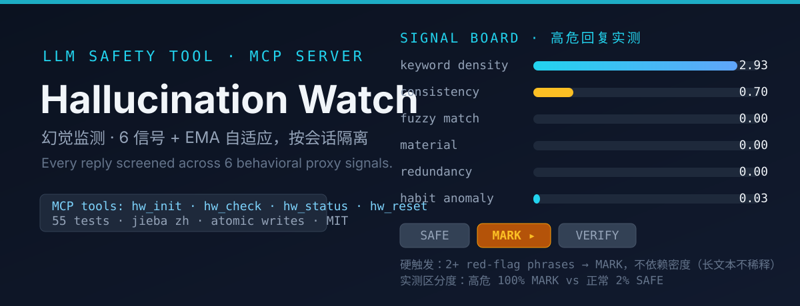

<p align="center">
  
</p>

# Hallucination Watch · 幻觉监测

**English** · A low-cost, **user-activated** hallucination risk screening skill for LLM conversations. Six behavioral proxy signals, EMA threshold adaptation, per-session isolation, MCP integration. No external APIs, no ground-truth oracles.

**中文** · 一款极低成本的幻觉监测 Skill：6 个行为代理信号 + EMA 阈值自适应 + 按会话隔离 + MCP 工具集成。无需第三方 API，不依赖真实标注。

---

## Quick Start / 快速开始

**English** · Activate monitoring, and every subsequent reply is automatically screened:

**中文** · 激活监测后，每次回复都会自动检查：

```text
User:  启动幻觉监测
Agent: → calls hw_init
       → .hw_active created, AGENTS.md monitoring rule injected
       → every subsequent reply: calls hw_check(text=回复全文, prev_text=上一轮)
       → high risk: risk card (MARK / VERIFY)
       → hard trigger: 2+ red-flag phrases → MARK immediately

User:  hw_status     → session stats (checks / alerts / habit profile)
User:  hw_reset      → clears session, marker, and AGENTS.md rule
```

---

## Why It Is Different / 与常规监测的区别

**English** · Six behavioral proxy signals instead of expensive oracles:

**中文** · 用 6 个行为代理信号替代昂贵的真实标注：

| Signal / 信号 | What it checks / 检测内容 |
|:---|:---|
| **Keyword density** / 关键词密度 | Absolute statements + red-flag phrases (3× weight) / 绝对化表述 + 红旗词（3 倍权重） |
| **Self-consistency** / 自洽性 | Jaccard similarity across turns / 跨轮 Jaccard 相似度 |
| **Fuzzy match** / 模糊匹配 | k-char fingerprint overlap, partial-sim (0.3–0.7) only / k 字符指纹哈希，仅部分相似计分 |
| **Material consistency** / 素材一致性 | Topic-gated contradiction detection (jieba) / jieba 话题门控 + 矛盾检测 |
| **Redundancy** / 冗余度 | Cumulative text volume (capped) / 累计文本量（有上限） |
| **Habit profile** / 习惯画像 | Character-position 5-bin distribution / 字符位置分布 + 异常度 |

**English** · **Hard trigger**: 2+ red-flag phrases (毫无疑问 / 百分百 / 百分之百 / 绝对保证 / 万无一失 …) → immediate **MARK**, bypassing density normalization so long texts never dilute the signal. Measured discrimination: high-risk 100% MARK vs normal 2% SAFE.

**中文** · **硬触发**：2 个及以上红旗词（毫无疑问 / 百分百 / 百分之百 / 绝对保证 / 万无一失 …）直接判定 **MARK**——不经过密度归一化，长文本不会稀释信号。实测区分度：高危 100% MARK vs 正常 2% SAFE。

---

## How It Works / 工作原理

**English** · Decision formula and zones:

**中文** · 决策公式与风险区间：

```
risk_raw = keyword × multiplier + consistency + fuzzy + material + redundancy + habit
risk_pct = risk_raw / threshold × 100        (threshold: per-session EMA 自适应)

Zone:  safe (<100%)    → silent / 静默
       mark (100–250%) → risk card / 风险卡片
       verify (≥250%)  → risk card / 风险卡片
```

**English** · Key properties:

**中文** · 核心特性：

- **English** · EMA threshold adaptation per session (written to `session.json`, never pollutes global params). / **中文** · EMA 阈值按会话自适应（写入 session.json，不污染全局参数）
- **English** · Per-session isolation with idempotent init across restarts. / **中文** · 按会话隔离，重启后幂等复用
- **English** · Crash-safe atomic writes (`tmp` + `os.replace`). / **中文** · 原子写入，崩溃安全
- **English** · Bounded storage: turn text truncated at 500 chars (full length tracked via `cumulative_text_len`); reference capped at 50 entries with dedup. / **中文** · 存储有界：单轮文本截断 500 字符（完整长度单独累计）；参考素材上限 50 条并去重

---

## Install / 安装

### Via MCP / 通过 MCP（any MCP-capable agent / 任意支持 MCP 的智能体）

```json
{
  "mcpServers": {
    "hallucination-watch": {
      "command": "python",
      "args": ["/path/to/hallucination-watch/scripts/hallucination_watch_mcp.py"]
    }
  }
}
```

**English** · Standard MCP stdio protocol (FastMCP) — works with pi, opencode, Claude Code, and any other MCP-capable agent.

**中文** · 标准 MCP stdio 协议（FastMCP）——兼容 pi、opencode、Claude Code 及任意支持 MCP 的智能体。

### Via CLI / 通过命令行（standalone / 独立使用）

```bash
python scripts/monitor.py init
python scripts/monitor.py check --file=response.json
python scripts/monitor.py status
python scripts/monitor.py reset
```

### Requirements / 依赖

**English** · `python ≥3.9` · `mcp` · `pydantic` · `jieba`

**中文** · 需要 `python ≥3.9`、`mcp`、`pydantic`、`jieba`

---

## Architecture / 架构

```
hallucination-watch/
├── SKILL.md                        ← Skill descriptor (Agent Skills spec) / 技能描述
├── README.md                       ← This file / 本文档
├── assets/readme/                  ← README visuals (SVG) / 视觉素材
├── params/
│   └── default.json                ← 19 configurable parameters / 19 个可配置参数
├── scripts/
│   ├── hallucination_watch_mcp.py  ← MCP server (4 tools, stdio) / MCP 服务器
│   ├── monitor.py                  ← CLI entry / 命令行入口
│   ├── check_compliance.py         ← Compliance verifier / 履约检查
│   ├── signal_keyword.py           ← Signal 1 / 信号 1：关键词密度 + 红旗词
│   ├── signal_consistency.py       ← Signal 2 / 信号 2：自洽性
│   ├── signal_fuzzy.py             ← Signal 3 / 信号 3：模糊匹配
│   ├── signal_material.py          ← Signal 4 / 信号 4：素材一致性
│   ├── signal_redundancy.py        ← Signal 5 / 信号 5：冗余度
│   ├── signal_habit.py             ← Signal 6 / 信号 6：习惯画像
│   ├── signal_adapt.py             ← EMA adaptation / EMA 自适应
│   ├── signal_topic.py             ← jieba topic embedding / 话题嵌入
│   └── signal_correction.py        ← Optional correction / 可选纠错（默认关闭）
├── tests/
│   └── test_hallucination_watch.py ← 55 unit tests / 55 个单元测试
└── sessions/                       ← Per-session data (auto-created, gitignored) / 会话数据
```

---

## Tests / 测试

```bash
python -m unittest tests.test_hallucination_watch -v
# 55 tests · signals / lifecycle / storage bounds / EMA / review regressions
# 55 个测试：信号 / 生命周期 / 存储上限 / EMA / 评审回归
```

---

## Parameter Reference / 参数参考

| Parameter / 参数 | Default / 默认值 | Description / 说明 |
|:---|:---:|:---|
| threshold | 22.0 | Initial risk threshold (per-session EMA adjusts it) / 初始风险阈值（EMA 按会话调整） |
| density_multiplier | 10 | Keyword density multiplier / 关键词密度倍数 |
| red_flag_keywords | 10 items | Hard-trigger phrases (≥2 → MARK) / 硬触发红旗词（≥2 个 → MARK） |
| k_chars | 7 | Fuzzy fingerprint length / 模糊指纹长度 |
| num_bins | 5 | Habit profile bins / 习惯画像分箱数 |
| redundancy_max_score | 40 | Redundancy score cap / 冗余度分数上限 |
| max_baseline_n | 10 | Baseline → active transition / 基线期轮数 |
| adaptation_interval | 10 | EMA re-calibration interval (turns) / EMA 校准间隔（轮） |
| target_trigger_rate | 0.10 | EMA target trigger rate / EMA 目标触发率 |
| topic_similarity_threshold | 0.15 | Topic gate for material checks / 素材话题门控阈值 |

**English** · Full list in `params/default.json`. / **中文** · 完整列表见 `params/default.json`。

---

## License / 许可证

MIT
